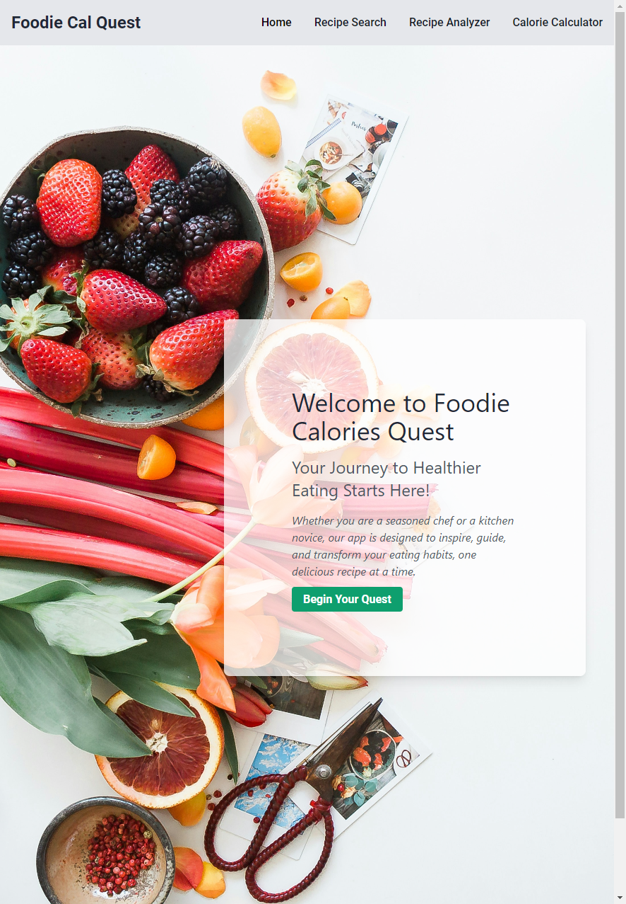
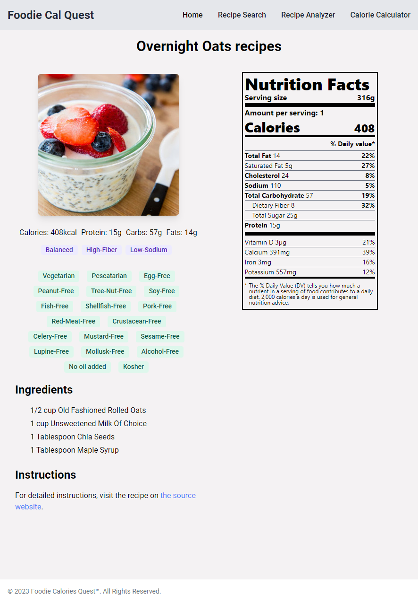

# Foodie Calories Quest

Foodie Calories Quest is a comprehensive web application designed to assist users in tracking their daily caloric intake and discovering new, nutritious recipes. With its user-friendly interface, the application facilitates recipe searches, provides detailed nutritional analyses, and offers personalized caloric need calculations based on individual user data.

## Features

- **Recipe Search**: Users can effortlessly search for recipes by specifying the meal type, including options like Breakfast, Dinner, Lunch, Snack, and Teatime. Each recipe is accompanied by a detailed nutritional label and dietary information, making healthy choices easier.

- **Calories Calculator**: The application features a personalized calorie calculator that estimates daily caloric needs by considering the user's weight, height, age, and activity level.

- **Nutritional Analysis**: Dive deep into the nutritional content of any recipe. Foodie Calories Quest deconstructs recipes into their ingredients and provides an exhaustive nutritional breakdown, empowering users with the knowledge to make informed dietary decisions.

## Getting Started

To get started with the project, follow these steps:

### Prerequisites

Ensure you have [Node.js](https://nodejs.org/en/) installed on your system to manage project dependencies and run the development server.

## Built With

- React.js - A JavaScript library for building user interfaces
- Axios - Promise-based HTTP client for the browser and node.js
- Tailwind CSS - A utility-first CSS framework for rapid UI development
- Vite - Frontend tooling that's fast
- Flowbite - Ready to use tailwind CSS components

## Screenshot

Link to deployed website: https://main--foodie-calories-quest.netlify.app/




### Installation

1. Clone the repository:
   ```sh
    git clone https://github.com/MichalTrostowiecki/foodie-calories-quest.git
2. Navigate to the project directory:
    ```sh
    cd foodie-calories-quest
3. Install the dependencies:
    ```sh
    npm install

### Running the Application

To start the development server, execute:
    ```sh
    npm run dev
Now, acess the application in your browser at http://localhost:3000


## Credits

We would like to thank the Edamam API for providing the recipe and nutrition data used in this application.

## License

This project is licensed under the MIT License - see the [LICENSE](LICENSE) file for details.
